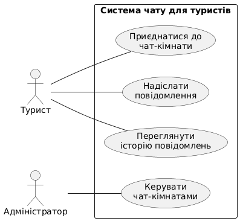
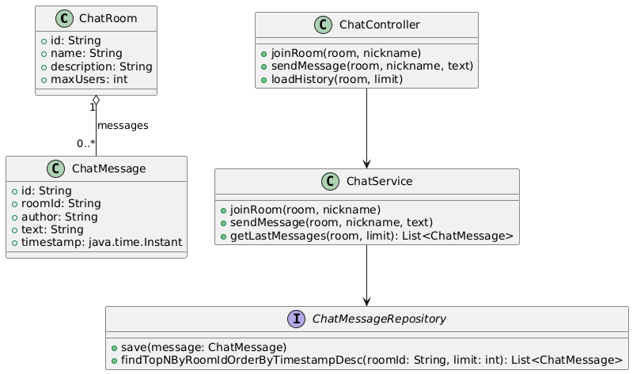
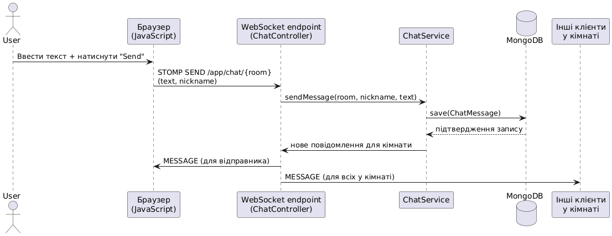
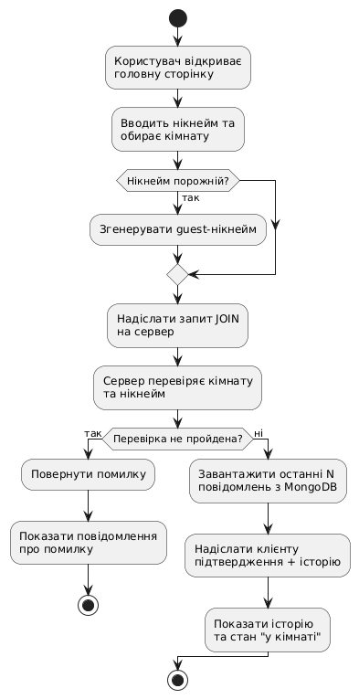
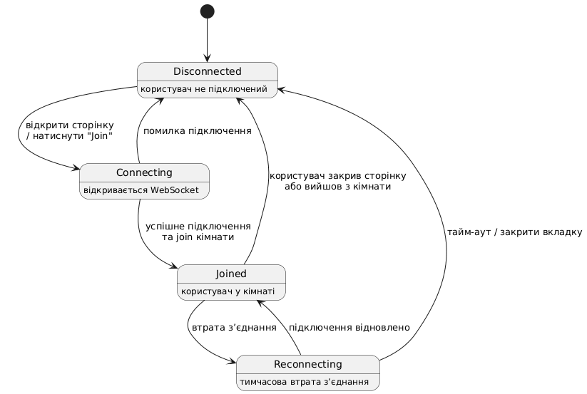
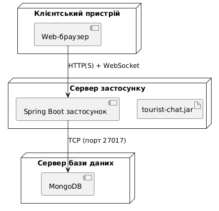

### 1.1. Концепція, вигляд і цінності програмного продукту. Предметна область, рішення, підходи та інструменти

Програмний продукт — це веб-застосунок «чат для туристів», який надає можливість мандрівникам спілкуватися між собою в режимі реального часу, обмінюватися локальними порадами та ставити практичні запитання щодо різних напрямків подорожей. Основна ідея полягає в тому, щоб забезпечити швидкий доступ до досвіду реальних людей замість тривалого пошуку інформації в статтях чи рекламних матеріалах.

З точки зору користувача система виглядає як сучасний веб-застосунок з кількома публічними чат-кімнатами, згрупованими за напрямками подорожей (наприклад, «World chat», «Europe», «Asia», «City tips» тощо). Користувач відкриває сайт, обирає нікнейм, вибирає кімнату і відразу може почати спілкування без тривалої реєстрації. Повідомлення з’являються миттєво, що створює ефект живої розмови з іншими туристами або місцевими жителями.

Предметна область системи — туризм та подорожі. Типові сценарії використання: запит рекомендацій щодо житла або транспорту, уточнення візових або безпекових нюансів, пошук попутників, обмін інформацією про маловідомі місця та локальні атракції. Продукт орієнтований на коротке, неформальне, але оперативне спілкування, а не на зберігання складних маршрутів чи повних турпакетів.

Ключова цінність для користувачів — швидкий доступ до актуальної інформації та можливість спілкування з реальними людьми з власним досвідом подорожей. Додаткові цінності: простота інтерфейсу, низький поріг входу (достатньо нікнейму замість повноцінного акаунта) і доступність з будь-якого пристрою з веб-браузером. Для модераторів і власників системи платформа слугує єдиною точкою концентрації туристичних обговорень, які можна аналізувати й модерувати.

Основні проєктні рішення:
- реалізація у вигляді вебзастосунку на Java з використанням Spring Boot як поширеного та зрілого enterprise-стеку;
- підтримка обміну повідомленнями в режимі реального часу через WebSocket, щоб повідомлення з’являлися без перезавантаження сторінки;
- поділ спілкування на кімнати за напрямками подорожей, що зменшує «шум» та полегшує пошук релевантних дискусій;
- спрощена модель користувача, що базується на нікнеймах, без обов’язкової реєстрації та збору конфіденційних персональних даних;
- використання документоорієнтованої бази даних MongoDB для зберігання повідомлень і пов’язаних даних, що полегшує роботу з динамічною структурою та великим обсягом чат-даних.

Система побудована за класичною клієнт–серверною моделлю. Серверна частина реалізована з використанням Java та Spring Boot. Spring MVC використовується для обробки HTTP-запитів і надання веб-сторінок або REST API, тоді як Spring WebSocket (за потреби — з використанням STOMP) забезпечує двонапрямлений обмін повідомленнями між клієнтами та сервером у реальному часі.

Для збереження історії повідомлень використовується MongoDB як документоорієнтована база даних. Кожне повідомлення або чат-кімната може зберігатися у вигляді окремого документа, що спрощує масштабування, дозволяє гнучко змінювати структуру даних і працювати з великими обсягами інформації. Доступ до MongoDB здійснюється за допомогою Spring Data MongoDB, що забезпечує зручний рівень абстракції над операціями з базою.

Клієнтська частина реалізована на JavaScript і забезпечує адаптивний інтерфейс, що коректно відображається як на настільних, так і на мобільних пристроях.

Обрані технології та підходи дають змогу створити мінімальний, але реалістичний прототип туристичного чату: його можна запускати як окремий Spring Boot-застосунок, легко розширювати новими кімнатами або функціями (приватні повідомлення, профілі користувачів, інструменти модерації тощо) і демонструвати на його основі основну концепцію системи.

### 1.2. Рівні вимог. Формалізація вимог

#### 1.2.1. Бізнес-вимоги (Business requirements)

1. Система має забезпечити онлайн-платформу для обміну досвідом і порадами між туристами, що дозволить зменшити час на пошук актуальної інформації про подорожі та підвищити задоволеність користувачів від планування поїздок.

---

#### 1.2.2. Вимоги користувача

1. Користувач повинен мати можливість зайти в чат без обов’язкової реєстрації, вказавши лише нікнейм.
2. Користувач повинен бачити список доступних чат-кімнат, згрупованих за напрямками (регіонами/темами).
3. Користувач повинен мати можливість приєднатися до обраної чат-кімнати.
4. Користувач повинен мати можливість надсилати текстові повідомлення до поточної кімнати.
5. Користувач повинен бачити в інтерфейсі всі нові повідомлення в реальному часі без перезавантаження сторінки.
6. Користувач повинен бачити, хто (нікнейм) надіслав повідомлення, та час його відправлення.
7. Інтерфейс системи повинен коректно відображатися як на настільних, так і на мобільних пристроях (адаптивний дизайн).

---

#### 1.2.3. Функціональні вимоги

1. Система повинна надавати можливість створення та конфігурації публічних чат-кімнат (наприклад, «World chat», «Europe», «Asia», «City tips»).
2. Система повинна надавати механізм приєднання користувача до вибраної кімнати на основі вказаного нікнейму.
3. Система повинна приймати від клієнта текстові повідомлення та прив’язувати їх до відповідної чат-кімнати.
4. Система повинна розсилати нові повідомлення всім підключеним клієнтам, які перебувають у відповідній кімнаті, у режимі реального часу (WebSocket).
5. Система повинна зберігати повідомлення в базі даних MongoDB із вказанням кімнати, автора, часу відправлення та тексту повідомлення.
6. Система повинна мати можливість повернути останні N повідомлень (наприклад, при вході до кімнати) для формування короткої історії чату.
7. Система повинна логувати підключення та відключення користувачів від серверу (для можливого аудиту та відлагодження).
8. Система повинна обмежувати надсилання порожніх або занадто довгих повідомлень (валідація на стороні сервера та/або клієнта).
9. Система повинна надавати базовий механізм обробки помилок (наприклад, недоступність сервера, помилки WebSocket-підключення) з відображенням зрозумілого повідомлення користувачу.
10. Система повинна забезпечити можливість конфігурації списку доступних чат-кімнат без зміни програмного коду.
11. Система повинна надавати HTTP-інтерфейс (MVC-контролери) для завантаження головної веб-сторінки чату та статичних ресурсів.

---

#### 1.2.4. Нефункціональні вимоги

1. **Продуктивність:** система повинна підтримувати одночасну роботу щонайменше 50 активних користувачів у чаті без суттєвої затримки доставки повідомлень (не більше 1–2 секунд за нормальних умов мережі).
2. **Надійність:** у разі короткочасної втрати з’єднання з сервером клієнтський застосунок повинен намагатися автоматично відновити WebSocket-підключення.
3. **Масштабованість:** архітектура системи повинна дозволяти горизонтальне масштабування (запуск декількох екземплярів Spring Boot-застосунку, спільний доступ до MongoDB).
4. **Безпека:** система не повинна вимагати та зберігати конфіденційні персональні дані (паспортні дані, платіжну інформацію тощо); зберігаються лише нікнейми та вміст повідомлень.
5. **Юзабіліті:** інтерфейс має бути інтуїтивно зрозумілим, усі основні дії (вибір кімнати, введення нікнейму, надсилання повідомлення) повинні виконуватися за 1–2 простих кроки.

---

#### 1.2.5. Системні вимоги (System requirements)

1. **Програмне забезпечення сервера:**
    - операційна система: Windows 11, Linux (Ubuntu 20.04+ або аналогічна);
    - Java Development Kit (JDK) версії 17;
    - система збирання: Maven;
    - середовище виконання: Spring Boot (стартовий JAR-застосунок);
    - встановлений сервер бази даних MongoDB (версія 6.x або сумісна).

2. **Програмне забезпечення клієнта:**
    - сучасний веб-браузер з підтримкою HTML5, CSS3 та WebSocket (Google Chrome, Mozilla Firefox);
    - доступ до мережі для встановлення HTTP- та WebSocket-з’єднання із сервером.

3. **Апаратні ресурси (мінімальні для розробницького середовища):**
    - процесор: 2 ядра або більше;
    - оперативна пам’ять: від 4 ГБ (рекомендовано 8 ГБ);
    - вільне місце на диску: від 1 ГБ для JDK, MongoDB, артефактів збірки та логів.

### 1.3. Аналіз вимог. Метрики

У цьому підрозділі проаналізовано 5 функціональних вимог із п. 1.2.3.  
Для зручності я позначаю їх як FR-i, де *i* — номер вимоги.

Обрані вимоги:
- **FR-1 (1.2.3, п.2):** приєднання користувача до вибраної кімнати на основі нікнейму.
- **FR-2 (1.2.3, п.3):** прийом текстових повідомлень від клієнта та прив’язка їх до кімнати.
- **FR-3 (1.2.3, п.4):** розсилка нових повідомлень усім клієнтам у кімнаті в режимі реального часу (WebSocket).
- **FR-4 (1.2.3, п.5):** збереження повідомлень у MongoDB (кімната, автор, час, текст).
- **FR-5 (1.2.3, п.6):** повернення останніх N повідомлень при вході до кімнати.

---

#### FR-1. Приєднання користувача до кімнати

**Формулювання:** система повинна надавати механізм приєднання користувача до вибраної кімнати на основі вказаного нікнейму.

- **Повнота / чіткість / узгодженість.** Вимога описує, що потрібно для входу (кімната + нікнейм). Не розписано деталі типу дублювання нікнеймів, але для навчального проєкту цього більш ніж достатньо. З іншими вимогами не конфліктує.
- **Перевірюваність.** Легко протестувати: користувач вводить нікнейм, обирає кімнату, а система має підключити його саме туди.
- **Необхідність та корисність.** Без цієї вимоги чат у принципі не працює, тому вона критично важлива.
- **Реалізовуваність.** Технічно це просто: у Spring Boot/WebSocket це підписка клієнта на певну «кімнату» (топік).
- **Трасованість.** Прив’язується до бізнес-вимоги про онлайн-платформу для спілкування та до user-вимог про вибір кімнати й нікнейму.
- **Важливість і стабільність.** Важливість — висока, стабільність — теж висока (сам принцип «користувач у кімнаті» навряд чи зміниться).
- **Метрики.** Наприклад:
    - середній час приєднання до кімнати;
    - відсоток успішних підключень;
    - кількість помилок при приєднанні (неіснуюча кімната, порожній нікнейм тощо).

---

#### FR-2. Прийом і прив’язка повідомлень до кімнати

**Формулювання:** система повинна приймати від клієнта текстові повідомлення та прив’язувати їх до відповідної чат-кімнати.

- **Повнота / чіткість / узгодженість.** Чітко вказано, що кожне повідомлення належить певній кімнаті. Параметри розміру та вмісту повідомлення винесені у вимогу про валідацію, тому суперечностей немає.
- **Перевірюваність.** Перевіряється через тест: користувач надсилає повідомлення з кімнати X, у логах або БД видно, що воно прив’язане саме до кімнати X.
- **Необхідність та корисність.** Це базова операція чату, без неї не буде жодного змісту в застосунку.
- **Реалізовуваність.** Легко реалізується через WebSocket-ендпойнт у Spring (метод із @MessageMapping або аналог).
- **Трасованість.** Підтримує user-вимогу «користувач може надсилати текстові повідомлення» і пов’язана з вимогами щодо збереження й розсилки повідомлень.
- **Важливість і стабільність.** Важливість — висока, стабільність — висока (формат повідомлень може змінюватися, але сам факт їх прийому — ні).
- **Метрики.** Можливі показники:
    - кількість успішно прийнятих повідомлень за хвилину;
    - відсоток відхилених (порожніх/занадто довгих) повідомлень;
    - середній час обробки повідомлення на сервері.

---

#### FR-3. Розсилка повідомлень у режимі реального часу

**Формулювання:** система повинна розсилати нові повідомлення всім підключеним клієнтам у відповідній кімнаті в режимі реального часу (WebSocket).

- **Повнота / чіткість / узгодженість.** Вимога достатньо повна: зрозуміло, кому надсилаємо (усім у кімнаті) і як (WebSocket). Деталі на кшталт порядку доставки вже технічні. З іншими вимогами узгоджується.
- **Перевірюваність.** Це можна заміряти: один клієнт надсилає повідомлення, інші фіксують час його появи, порівнюється затримка.
- **Необхідність та корисність.** Фактично це «серце» чату — без миттєвої розсилки немає ефекту живого спілкування.
- **Реалізовуваність.** Spring Boot + WebSocket добре підходять для таких сценаріїв, тож вимога цілком реалістична.
- **Трасованість.** Йде від бізнес-вимоги про зменшення часу отримання актуальної інформації та пов’язана з нефункціональною вимогою щодо продуктивності.
- **Важливість і стабільність.** За важливістю — одна з перших. Стабільність також висока, хіба що можуть додаватися нюанси (наприклад, підтвердження доставки).
- **Метрики.** Наприклад:
    - середня затримка доставки повідомлення (від відправлення до відображення);
    - відсоток повідомлень, доставлених швидше, ніж за X мілісекунд;
    - кількість активних WebSocket-підключень.

---

#### FR-4. Збереження повідомлень у MongoDB

**Формулювання:** система повинна зберігати повідомлення в базі даних MongoDB із вказанням кімнати, автора, часу відправлення та тексту повідомлення.

- **Повнота / чіткість / узгодженість.** Описано всі основні поля, яких достатньо для історії чату. Про індекси, TTL та архівацію можна домовлятися окремо. З іншими вимогами про історію все логічно зв’язано.
- **Перевірюваність.** Перевіряється дуже просто: після відправлення повідомлення можна зробити запит до MongoDB і переконатися, що документ збережено з правильними полями.
- **Необхідність та корисність.** Важливо для збереження історії, аналізу та подальшого розвитку системи (наприклад, пошук по історії).
- **Реалізовуваність.** Spring Data MongoDB сильно спрощує роботу, тому реалізувати це не складно.
- **Трасованість.** Пов’язана з вимогами про відображення історії повідомлень, а також із системною вимогою використання MongoDB.
- **Важливість і стабільність.** Важливість — середня/висока (для мінімального демо можна теоретично обійтися без БД, але для нормального продукту — обов’язкова). Стабільність — висока, бо полями «кімната/автор/час/текст» навряд чи жертвуватимуть.
- **Метрики.** Можна відслідковувати:
    - середній час запису одного повідомлення;
    - відсоток помилок запису;
    - швидкість росту колекції (повідомлень за добу);
    - час виконання запиту на вибірку історії.

---

#### FR-5. Повернення останніх N повідомлень при вході

**Формулювання:** при вході до кімнати система повертає користувачу останні N повідомлень (коротка історія чату).

- **Повнота / чіткість / узгодженість.** Умовно вважаємо, що N задається в налаштуваннях. Вимога узгоджується з FR-4 (збереження в БД) і з user-вимогами про зручність користування.
- **Перевірюваність.** Можна створити в кімнаті M повідомлень, потім зайти новим користувачем і перевірити, що він отримав саме N останніх, у правильному порядку.
- **Необхідність та корисність.** Для «виживання» чату вона не критична, але сильно покращує юзабіліті, бо користувач бачить контекст розмови.
- **Реалізовуваність.** Це звичайний запит до MongoDB з сортуванням за часом та обмеженням на кількість документів (sort + limit).
- **Трасованість.** Виходить із user-вимог щодо зручності перегляду історії та нефункціональних вимог з продуктивності запитів.
- **Важливість і стабільність.** Важливість — середня. Стабільність — середня/висока: N може змінюватися, але сам факт показу історії при вході, скоріш за все, залишиться.
- **Метрики.** Наприклад:
    - середній час відповіді на запит «вхід до кімнати з історією»;
    - доля запитів, що виконуються швидше за заданий поріг (наприклад, < 500 мс);
    - точність: у скількох відсотках випадків користувач отримує рівно N останніх повідомлень.

---

#### Порівняння за важливістю та стабільністю

Якщо впорядкувати ці вимоги за важливістю для роботи системи, отримаємо приблизно такий порядок:

1. **FR-3** — розсилка повідомлень у реальному часі (основний ефект «живого» чату).
2. **FR-2** — прийом і прив’язка повідомлень до кімнат.
3. **FR-1** — приєднання користувача до кімнати.
4. **FR-4** — збереження повідомлень у MongoDB.
5. **FR-5** — повернення останніх N повідомлень при вході.

За стабільністю усі ці вимоги досить стійкі: змінюватися можуть головно технічні деталі реалізації або конкретні параметри (наприклад, значення N), а не сама сутність вимог.

### 1.4. Backlog та планування спринтів

У цьому пункті я склав backlog для веб-застосунку «чат для туристів», розставив пріоритети, розбив задачі на спринти та детальніше розписав один спринт із ролями і критеріями перевірки.

---

#### 1.4.1. Загальний backlog

Backlog я формував від найнеобхіднішого (щоб чат взагалі запрацював) до того, що вже «допилює» зручність та нефункціональні вимоги.

Позначення пріоритетів:
- **P1** — критично важливо;
- **P2** — бажано в першій версії;
- **P3** — можна доробити пізніше.

| ID  | Задача                                                        | Пріоритет | Коротко, що треба зробити                                                  |
|-----|----------------------------------------------------------------|-----------|----------------------------------------------------------------------------|
| B1  | Створити каркас Spring Boot-застосунку                         | P1        | Ініціалізувати проєкт, додати залежності (Web, WebSocket, MongoDB).        |
| B2  | Налаштувати підключення до MongoDB                             | P1        | Підняти MongoDB, прописати підключення в `application.properties`.         |
| B3  | Описати модель даних для повідомлень і кімнат                  | P1        | Сутності + репозиторії для Spring Data MongoDB.                            |
| B4  | Зробити просту головну веб-сторінку чату                       | P2        | Верстка: список кімнат, поле нікнейму, зона повідомлень, інпут для тексту. |
| B5  | Реалізувати приєднання користувача до кімнати                  | P1        | Вибір кімнати, нікнейм, підписка на відповідний WebSocket-канал.           |
| B6  | Реалізувати надсилання повідомлень від клієнта                 | P1        | Відправка повідомлення з фронтенду на бекенд.                              |
| B7  | Реалізувати розсилку повідомлень усім клієнтам у кімнаті       | P1        | Трансляція отриманих повідомлень усім підключеним у цій кімнаті.           |
| B8  | Зберігати повідомлення в MongoDB                               | P1        | Запис у колекцію з полями кімната/автор/час/текст.                         |
| B9  | Повернення останніх N повідомлень при вході до кімнати         | P2        | Запит до БД + вивід історії при підключенні.                               |
| B10 | Валідація нікнейму та тексту повідомлення                      | P2        | Перевірка на порожні значення та максимальну довжину.                      |
| B11 | Логування підключень, відключень та помилок                    | P2        | Логи WebSocket-подій і помилок БД.                                         |
| B12 | Адаптивна верстка інтерфейсу                                   | P3        | Щоб нормально виглядало і на телефоні, і на десктопі.                      |
| B13 | Автоматичне відновлення WebSocket-підключення                  | P3        | Реконект при коротких розривах з’єднання.                                  |
| B14 | Базові метрики продуктивності                                  | P3        | Заміряти час обробки/доставки повідомлень, залогувати.                     |

---

#### 1.4.2. Групування задач по спринтах

Я умовно розбив роботу на три спринти (по суті, це три етапи).

**Sprint 1 – Підготовка бази**

Основна ідея — щоб застосунок взагалі запускався, бачив MongoDB та мав хоч якийсь інтерфейс.

- B1 — каркас Spring Boot-застосунку;
- B2 — підключення MongoDB;
- B3 — модель даних (повідомлення, кімнати);
- B4 — проста головна сторінка;
- B11 — базове логування.

**Sprint 2 – Основний функціонал чату**

На цьому етапі маю отримати вже «живий» чат, яким можна користуватися.

- B5 — приєднання користувача до кімнати;
- B6 — надсилання повідомлень;
- B7 — розсилка повідомлень усім у кімнаті;
- B8 — збереження повідомлень у MongoDB;
- B9 — повернення останніх N повідомлень;
- B10 — валідація нікнейму та тексту.

**Sprint 3 – Полірування та нефункціональні речі**

Тут уже не стільки «запустити», скільки зробити нормально і зручніше.

- B12 — адаптивна верстка;
- B13 — автоматичний реконект WebSocket;
- B14 — базові метрики (логування часу, проста оцінка продуктивності);
- дрібні виправлення за результатами тестів.

---

#### 1.4.3. План спринту (приклад: Sprint 2)

Найцікавіший для мене — **Sprint 2**, бо саме тут з’являється основна логіка чату.

##### Ролі

Фактично все роблю я, але для формальності можна виділити такі ролі:

- **Product Owner (PO)** — задає вимоги і пріоритети (по суті, викладач/замовник).
- **Developer (Dev)** — пише код на Java/Spring Boot та JavaScript.
- **QA / Tester (QA)** — перевіряє, чи все працює згідно з вимогами.
- **UI/UX** — дивиться, щоб інтерфейс був хоча б мінімально зручний.

(У реальності це одна людина, просто в різні моменти я виконую різні ролі.)

##### Задачі спринту та хто за що відповідає

| ID  | Задача                                             | Ролі           |
|-----|----------------------------------------------------|----------------|
| B5  | Приєднання користувача до кімнати                  | Dev, QA, UI    |
| B6  | Надсилання повідомлень від клієнта                 | Dev, QA, UI    |
| B7  | Розсилка повідомлень усім клієнтам у кімнаті       | Dev, QA        |
| B8  | Збереження повідомлень у MongoDB                   | Dev, QA        |
| B9  | Повернення останніх N повідомлень при вході        | Dev, QA        |
| B10 | Валідація нікнейму та тексту повідомлення          | Dev, QA, UI    |

##### Критерії перевірки (як розумію, що задача зроблена)

**B5 – Приєднання до кімнати**

- Можна ввести нікнейм, вибрати кімнату й підключитися.
- Після підключення видно, в якій кімнаті я зараз.
- Якщо кімната не обрана, система не дає приєднатися (або сірий кнопка, або повідомлення).
- Перевірка: спробувати підключитися з нормальним нікнеймом, з порожнім нікнеймом і без вибраної кімнати.

**B6 – Надсилання повідомлень**

- Вводжу текст, тисну Enter або кнопку «Send» — повідомлення з’являється в списку.
- Порожній текст (або лише пробіли) не відправляється.
- Після відправлення поле введення очищується.
- Перевірка: короткий текст, довгий текст, порожній текст.

**B7 – Розсилка повідомлень усім у кімнаті**

- Відкриваю дві вкладки в браузері, заходжу в одну й ту саму кімнату під різними нікнеймами.
- Якщо в одній вкладці написати повідомлення, воно з’являється в обох.
- У іншій кімнаті це повідомлення не з’являється.
- Затримка — умовно до 1–2 секунд.
- Перевірка: вручну прогнати цей сценарій.

**B8 – Збереження в MongoDB**

- Після відправлення повідомлення в колекції MongoDB з’являється новий документ з полями `room`, `author`, `timestamp`, `text`.
- Якщо перезапустити сервер, історія не зникає.
- Перевірка: відправити кілька повідомлень і подивитись їх у MongoDB (через mongo shell або GUI).

**B9 – Останні N повідомлень при вході**

- Коли новий користувач заходить у кімнату, він одразу бачить останні N повідомлень.
- Якщо повідомлень менше, ніж N, показуються всі.
- Порядок — від старіших до новіших.
- Перевірка: створити більше, ніж N повідомлень, потім зайти новим користувачем.

**B10 – Валідація нікнейму та тексту**

- Нікнейм не може бути порожнім (або система сама підставляє якийсь GuestXXX).
- Нікнейм і текст мають обмеження по довжині (наприклад, 30 символів для ніку, 500 — для тексту).
- Якщо обмеження порушені, на фронтенді показується помилка і запит на сервер не йде.
- Перевірка: ввести надто довгий нікнейм, дуже довге повідомлення, порожній нікнейм і порожній текст.

##### Коли вважаю, що Sprint 2 завершений

Для себе вважаю Sprint 2 закритим, якщо:

1. Усі задачі B5–B10 реалізовані і застосунок збирається та запускається.
2. Можна:
    - зайти в кімнату під нікнеймом;
    - писати повідомлення;
    - отримувати їх у реальному часі на кількох вкладках;
    - бачити історію останніх повідомлень при вході.
3. Повідомлення реально лежать у MongoDB (і читаються звідти).
4. Валідація нікнейму і тексту працює.
5. Я вручну прогнав основні сценарії й не помітив критичних багів.

### 1.5. UML-діаграми

У цьому пункті я використовую підготовлені зображення UML-діаграм.  
Усі файли діаграм лежать у окремій папці, наприклад `images/`.

---

#### 1.5.1. Use-case діаграма

На діаграмі показані основні актори системи (турист і адміністратор) та їхні сценарії роботи з чат-застосунком.

---

#### 1.5.2. Class діаграма

На діаграмі відображені основні класи бекенду: кімната чату, повідомлення, контролер, сервіс та репозиторій MongoDB, а також зв’язки між ними.

---

#### 1.5.3. Sequence діаграма

Ця діаграма показує послідовність взаємодій під час надсилання повідомлення: від дій користувача в браузері до збереження в MongoDB та доставки іншим учасникам кімнати.

---

#### 1.5.4. Activity діаграма

Тут зображено основний потік дій при приєднанні користувача до чат-кімнати та завантаженні історії повідомлень.

---

#### 1.5.5. State діаграма

Ця діаграма описує стани WebSocket-підключення користувача (відсутність з’єднання, підключення, приєднаний до кімнати, повторне підключення тощо).

---

#### 1.5.6. Deployment діаграма

На діаграмі показано розгортання системи: клієнтський браузер, сервер Spring Boot із чат-застосунком та окремий сервер бази даних MongoDB.

### 1.6. Математичне забезпечення. Математичне моделювання

У цьому пункті я задаю просту математичну модель чату для туристів: описую основні множини, операції над ними та кілька кількісних характеристик (метрик).

---

#### 1. Основні множини та структури даних

У системі виділяю три базові множини:

- множина користувачів  
  U = {u1, u2, …, un}

- множина чат-кімнат  
  R = {r1, r2, …, rm}

- множина всіх повідомлень  
  M = {m1, m2, …, mk}

Користувача ui розглядаю як кортеж параметрів:

ui = (id_u, nick, su, ru),

де  
• id_u – внутрішній ідентифікатор користувача в системі;  
• nick – нікнейм;  
• su ∈ {0, 1} – стан користувача (0 – офлайн, 1 – онлайн);  
• ru ∈ R – кімната, в якій користувач зараз перебуває.

Кімната rj описується так:

rj = (id_r, name, desc, maxUsers),

де id_r – ідентифікатор, name – назва кімнати, desc – опис, maxUsers – максимальна (рекомендована) кількість одночасних користувачів.

Повідомлення mk:

mk = (id_m, roomId, author, text, ts),

де id_m – ідентифікатор повідомлення, roomId ∈ R – кімната, author – автор (нік або id), text – вміст, ts – час відправлення.

---

#### 2. Основні операції як відображення

1. **Приєднання до кімнати (join)**

   join : U × R → {0, 1}

   Приєднання вважається успішним, якщо join(ui, rj) = 1.  
   Якщо кімната не існує, перевищено maxUsers або нікнейм невалідний, то join(ui, rj) = 0.

2. **Надсилання повідомлення (send)**

   Нехай T – множина всіх можливих текстів повідомлень.

   send : U × R × T → M

   Для пари (ui, rj) і тексту t створюється новий елемент mk ∈ M, який буде збережений у БД та розісланий іншим користувачам кімнати.

3. **Отримання історії повідомлень (history)**

   history : R × N → M≤N

   Для кімнати r і числа N функція history(r, N) повертає впорядкований за часом список не більше ніж N останніх повідомлень цієї кімнати.

4. **Множина активних користувачів кімнати**

   Для кімнати r ∈ R множина активних користувачів Ur визначається як

   Ur = { u ∈ U | su = 1 і ru = r }.

5. **Розсилка повідомлення (broadcast)**

   broadcast : M × R → Ur

   Операція broadcast(m, r) означає доставку повідомлення m всім користувачам із множини Ur.

---

#### 3. Потік повідомлень і навантаження

Для оцінки продуктивності системи вводжу кілька кількісних параметрів.

1. **Інтенсивність потоку повідомлень у кімнаті**

   Нехай за проміжок часу ΔT (наприклад, 60 секунд) у кімнату r прийшло Nmsg(r, ΔT) нових повідомлень.  
   Тоді середню інтенсивність потоку повідомлень у цій кімнаті можна приблизно оцінити як

   λr ≈ Nmsg(r, ΔT) / ΔT.

2. **Пропускна здатність сервера**

   Нехай μ – середня кількість повідомлень за секунду, які сервер здатен  
   • прийняти,  
   • зберегти в MongoDB,  
   • розіслати всім клієнтам.

   Необхідна умова нормальної роботи системи:

   λr < μ  для всіх «активних» кімнат r.

3. **Затримка доставки повідомлення**

   Для кожного повідомлення mk фіксуємо
    - tsend,k – час, коли автор натиснув «Send»;
    - treceive,k – час, коли інший користувач побачив це повідомлення.

   Тоді затримка доставки

   Δtk = treceive,k − tsend,k.

   Середня затримка для n повідомлень:

   Δt̄ = (1 / n) · Σ (від k = 1 до n) Δtk.

   Для «живого» чату бажано, щоб Δt̄ була в межах 1–2 секунд.

---

#### 4. Узагальнення

Отже, математичне моделювання в цьому проєкті зводиться до:

- задання трьох основних множин U, R, M і структур даних для елементів цих множин;
- опису ключових операцій join, send, history, broadcast як відображень між цими множинами;
- введення базових кількісних характеристик (λr, μ, Δt̄), які дозволяють оцінювати навантаження на систему та комфортність роботи користувача в чаті.

