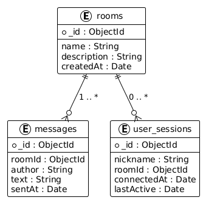

## 2. Design

### 2.1. Block-scheme. Justification of the complexity of individual blocks of the algorithm

Для розділу Design я взяв основний сценарій роботи застосунку – обробку текстового повідомлення в чаті.

Нижче коротко описую, що відбувається в кожному блоці, і яку асимптотичну складність має ця частина алгоритму.

1. **Ввід нікнейму та вибір кімнати**  
   Користувач вводить `nickname` і обирає `room` зі списку.  
   З точки зору алгоритму це одна дія, яка не залежить від кількості користувачів чи повідомлень.  
   **Складність:** O(1).

2. **Перевірка нікнейму та кімнати**  
   Перевіряю, що:
    - нікнейм не порожній;
    - довжина нікнейму не перевищує ліміт;
    - обрана кімната існує в системі.  
      Перевірка нікнейму по символах має складність O(L), де L – довжина ніка. Оскільки в системі я обмежую L (наприклад, до 30 символів), на практиці це поводиться як O(1). Перевірка кімнати виконується через один запит до колекції `rooms`, тому теж O(1).  
      **Складність:** умовно O(1).

3. **Встановлення WebSocket-підключення та JOIN**  
   Після успішної перевірки клієнт відкриває WebSocket-з’єднання із сервером та надсилає команду `JOIN` для обраної кімнати.  
   Це один запит і одна відповідь від сервера.  
   **Складність:** O(1).

4. **Завантаження останніх N повідомлень**  
   Сервер робить запит до MongoDB: знайти повідомлення цієї кімнати, відсортувати їх за часом і повернути останні N. Потім клієнт виводить N елементів у інтерфейс.  
   По кількості елементів це O(N) на стороні сервера (отримати список) і O(N) на стороні клієнта (намалювати їх у DOM). У лабораторному варіанті N – невелике фіксоване число (наприклад, 20), тому це не створює проблем.  
   **Складність:** O(N).

5. **Ввід нового повідомлення**  
   Користувач набирає текст у полі введення й натискає кнопку «Send» або Enter.  
   Для алгоритму це одна подія – фактично тригер на відправку.  
   **Складність:** O(1).

6. **Перевірка тексту повідомлення**  
   Перевіряю, що:
    - текст не порожній;
    - довжина не перевищує максимальний ліміт (наприклад, 500 символів).  
      Перевірка по символах дає O(L), де L – довжина тексту. Знову ж таки, L обмежене зверху, тому на практиці це невеликі витрати.  
      **Складність:** O(L), де L – довжина повідомлення.

7. **Збереження повідомлення в MongoDB**  
   Сервер створює документ у колекції `messages` з полями `roomId`, `author`, `text`, `sentAt` і записує його в базу.  
   Для одного insert-операції в колекцію це вважається сталою кількістю кроків.  
   **Складність:** O(1).

8. **Пошук активних користувачів кімнати**  
   На сервері для кожної кімнати підтримується список активних WebSocket-сесій.  
   Щоб розіслати повідомлення, сервер має пройти по всіх сесіях кімнати. Якщо в кімнаті зараз Ur користувачів, то обхід списку дає **O(Ur)**.

9. **Розсилка повідомлення всім клієнтам кімнати**  
   Сервер послідовно відправляє це повідомлення в кожне активне WebSocket-підключення кімнати.  
   Кількість операцій прямо пропорційна кількості користувачів у кімнаті – Ur.  
   **Складність:** O(Ur).

10. **Відображення нового повідомлення на клієнті**  
    Кожен клієнт додає новий елемент у список повідомлень (вставка елемента в DOM).  
    Для однієї вставки це O(1).

Якщо звести воєдино блоки, які залежать від розміру даних, то для одного повідомлення основна асимптотична складність виглядає так:

- O(L) – перевірка тексту;
- O(N) – обробка історії;
- O(Ur) – розсилка всім користувачам кімнати.

Тобто **O(L + N + Ur)**.  
У нашому чаті L і N обмежені, тому в реальній роботі найбільше впливає кількість активних користувачів у кімнаті Ur.

---

### 2.2. Data schema

Для зберігання даних я використовую MongoDB. У базі є три основні колекції:

- `rooms` – опис чат-кімнат;
- `messages` – усі повідомлення;
- `user_sessions` – інформація про активні сесії користувачів.

Зв’язки між сутностями такі:
- одна кімната (`rooms`) має багато повідомлень (`messages`);
- одна кімната (`rooms`) може мати багато активних сесій (`user_sessions`).

Схему даних я зобразив на окремій діаграмі:

Нижче – текстовий опис кожної колекції.

#### 2.2.1. Колекція `rooms`

У цій колекції зберігаються всі кімнати чату.

| Поле        | Тип      | Опис                                       |
|------------|----------|--------------------------------------------|
| `_id`      | ObjectId | унікальний ідентифікатор кімнати           |
| `name`     | String   | назва кімнати                              |
| `description` | String| короткий текстовий опис кімнати            |
| `createdAt`| Date     | дата й час створення кімнати               |

Для поля `name` доречно зробити унікальний індекс, щоб не було двох кімнат з однаковою назвою.

#### 2.2.2. Колекція `messages`

Тут зберігаються всі повідомлення, які були надіслані в чаті.

| Поле        | Тип      | Опис                                           |
|------------|----------|------------------------------------------------|
| `_id`      | ObjectId | унікальний ідентифікатор повідомлення          |
| `roomId`   | ObjectId | посилання на `_id` кімнати з колекції `rooms` |
| `author`   | String   | нікнейм автора повідомлення                    |
| `text`     | String   | текст повідомлення                             |
| `sentAt`   | Date     | дата й час відправлення                        |

Між `rooms` і `messages` зв’язок «один до багатьох»: одна кімната може мати багато повідомлень.  
Щоб швидко отримувати історію, у базі створюється індекс за полями `roomId` і `sentAt`. Це дає можливість швидко вибрати останні N повідомлень конкретної кімнати.

#### 2.2.3. Колекція `user_sessions`

Колекція `user_sessions` потрібна для того, щоб відстежувати активні підключення користувачів (хто зараз онлайн і в якій кімнаті знаходиться).

| Поле          | Тип      | Опис                                               |
|--------------|----------|----------------------------------------------------|
| `_id`        | ObjectId | унікальний ідентифікатор сесії                     |
| `nickname`   | String   | нікнейм, з яким користувач зайшов у чат            |
| `roomId`     | ObjectId | посилання на кімнату (`rooms._id`), де він зараз   |
| `connectedAt`| Date     | час встановлення підключення                       |
| `lastActive` | Date     | час останньої активності (останнє повідомлення тощо)|

За рахунок індексу по `roomId` можна швидко отримати список усіх активних користувачів певної кімнати, а індекс по `lastActive` дозволяє знайти «застарілі» сесії та при необхідності їх видалити.

---

У підсумку, розділ Design описує:
- як саме обробляється повідомлення (через блок-схему й оцінку складності окремих блоків);
- як виглядає структура даних у MongoDB (три колекції, їх поля та зв’язки між ними).
